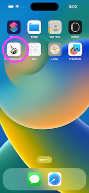
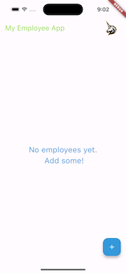
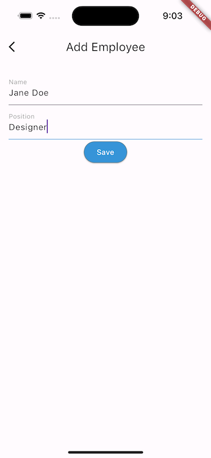
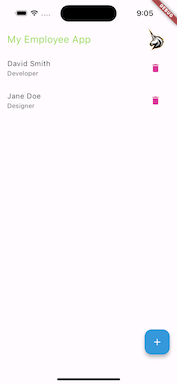

# Employees - A Flutter Mobile Application

## Introduction
**Employees** is a mobile application developed using Flutter, designed to streamline the process of viewing and editing a list of employees. This application stands out with its localization features and white-label support through configurable JSON, making it adaptable and user-friendly for various business needs.

## Features
- **Employee Management:** Efficiently view and edit employee details. add and remove employees
- **Localization Support:** The application features localized text to cater to a diverse user base.
- **White Label Ready:** Comes with a configurable JSON file, enabling easy branding and customization for various organizations.
- **Tests:**  Includes sample unit tests.
- **Application Icon:** applecation customized icon.

## Technologies
- **Flutter:** A UI toolkit by Google for crafting natively compiled applications for mobile, web, and desktop from a single codebase.
- **Dart:** The programming language used for developing Flutter applications.

## Screens

## Installation and Setup
To get started with the Employees app, follow these steps:

1. **Clone the Repository:**
git clone https://github.com/yuvalyn/yael_eran.git
2. **Navigate to the Project Directory:** cd yael_eran
3. **Install Dependencies:** flutter pub get
4. **Run the Application:** flutter run

## Usage
After installation, you can start using the app to manage employee data. The UI is intuitive, offering seamless navigation for viewing and editing employee details.

## Support and Contact
For support or inquiries, please contact yaeleran@gmail.com.
